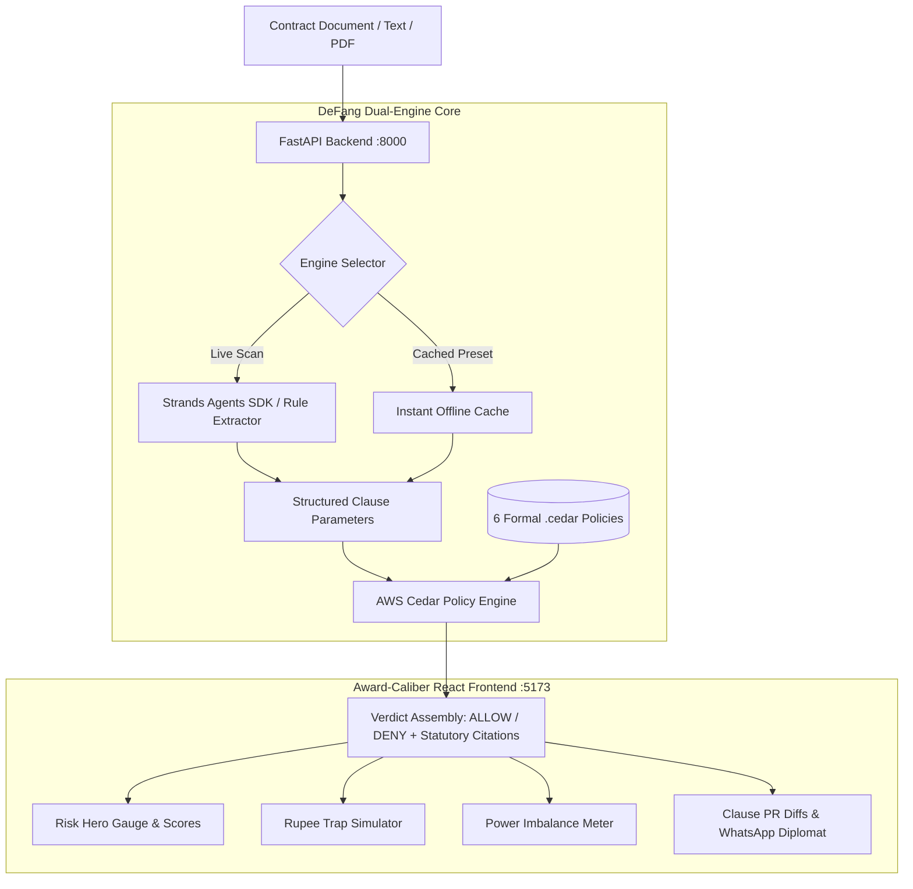

# DeFang — Stop Signing Toxic Indian Agreements. Scan, DeFang, and Negotiate.

[](https://github.com/Pranay207/DeFang)
[](https://github.com/Pranay207/DeFang)
[](https://github.com/Pranay207/DeFang)
[](https://www.cedarpolicy.com/)
[](https://fastapi.tiangolo.com/)
[](https://react.dev/)

**DeFang scans Indian rental, employment, and freelance contracts and deterministically flags predatory clauses against actual Indian statutes — with zero legal fees and zero guesswork.**

[](VIDEO_URL)
[](DEPLOYED_URL)
[](#-quick-start)

---

## The Problem

Over **85% of young Indians sign rental agreements, employment bonds, and freelance contracts without reading past the first page**, unknowingly forfeiting statutory protections. Landlords demand extortionate **10-month deposits and non-negotiable painting deductions**, while startups enforce **illegal 2-year non-competes and ₹2.5L training bonds**. Verifying contract legality requires hiring an advocate that ordinary tenants and freshers cannot afford, leaving millions defenseless against systemic contractual traps.

---

## Why This Is Different

Generic AI contract tools rely on a **single LLM giving subjective, unverifiable advice** that frequently hallucinates, contradicts itself, and cannot be audited in a courtroom.

**DeFang introduces an auditable, dual-engine architecture:**
1. **Extraction Layer**: The **Strands Agents SDK** parses and structures natural language contract text into strongly typed clause schemas (`backend/agent.py`).
2. **Deterministic Verification Layer**: **AWS Cedar** (`cedarpy`), a formal mathematical policy engine, evaluates those extracted parameters against immutable `.cedar` policy files encoding real Indian statutory law (`backend/policies/`).
3. **Auditable Citations**: Every single verdict produces a definitive **ALLOW** or **DENY** anchored to an exact statutory section (e.g. Model Tenancy Act Section 9)—not a vague "this feels risky" probability.
4. **100% On-Device & Offline**: Preset contract scans execute **completely offline on your machine with 0 network calls, 0 cloud dependencies, and 0 AWS bills**—fully adhering to the *Build It* track ethos.

### Proof: How Indian Law Is Encoded into AWS Cedar

Here is [`backend/policies/deposit_cap.cedar`](backend/policies/deposit_cap.cedar) deterministically forbidding rental security deposits exceeding 3 months under Section 9 of the Model Tenancy Act 2021:

```cedar
// cite: Model Tenancy Act 2021, Sec 9
// Forbid security deposits exceeding 3 months of agreed monthly rent
@id("deposit_cap")
@cite("Model Tenancy Act 2021, Sec 9")
@title("Excessive Security Deposit Cap Violation")
forbid (
    principal,
    action == Action::"enforce_clause",
    resource
)
when {
    resource.category == "deposit" &&
    resource.monthly_rent_inr > 0 &&
    resource.amount_inr > (resource.monthly_rent_inr * 3)
};
```

---

## Key Features

| Feature | What It Delivers |
| :--- | :--- |
| 🛡️ **Dual-Engine Scanning** | Pairs Strands agentic extraction with the AWS Cedar Policy Engine for deterministic statutory verdicts. |
| ⚖️ **Statutory Policy Verification** | Formally validates agreements against Model Tenancy Act 2021, Indian Contract Act 1872, and Usurious Loans Act 1918. |
| 💸 **Hidden Rupee Trap Simulator** | Dynamically calculates the exact financial liability (excess deposits, illegal exit deductions, penal interest) buried in clauses. |
| ⚖️ **Power Imbalance Meter** | Measures contractual asymmetry (such as 90-day tenant notice vs. 15-day landlord notice) with an actionable imbalance index. |
| 🔍 **Clause-by-Clause Policy Audit** | Explains each violation with plain-language ELI5 summaries, exact legislative citations, and severity scoring. |
| ⚡ **One-Click Instant Demo Presets** | Zero-latency instant offline cache evaluating 3 notorious real-world Indian contracts in under 5 milliseconds. |
| 💬 **WhatsApp Counter-Offer Diplomat** | Generates 3 calibrated counter-negotiation tones (Polite, Assertive, Hardball) with statutory backing to paste into WhatsApp. |
| 🔄 **GitHub-Style Contract PR Diff** | Visualizes side-by-side redline diffs comparing predatory original clauses with legally compliant redrafts. |
| 🌐 **Trilingual Interface (EN / हिंदी / తెలుగు)** | Translates legal reasoning and counter-clauses across English, Hindi, and Telugu for grassroots accessibility. |

---

## Architecture



---

## Tech Stack

| Category | Technology |
| :--- | :--- |
| **Auth & Policy Engine** | **AWS Cedar** (`cedarpy==4.12.0`) — Formal policy execution on local machine |
| **Agent & Extraction** | **Strands Agents SDK** (`strands-agents==1.56.0`) with intelligent local rule fallback |
| **Backend API** | **FastAPI**, **Uvicorn**, **Pydantic**, Python 3.12 |
| **Document Processing** | **pdfplumber**, **pypdfium2** for local client-side PDF parsing |
| **Frontend Framework** | **React 19**, **TypeScript**, **Vite** |
| **Styling & Motion** | **Tailwind CSS**, **Framer Motion** (spring physics, GPU-accelerated drift & glow) |
| **UI Components** | **Lucide React**, **React Circular Progressbar**, **Canvas Confetti** |

---

## ⚡ Quick Start

Clone the repository and run both servers locally on your machine in under 2 minutes:

### 1. Backend (FastAPI + AWS Cedar)

```powershell
cd backend
python -m venv .venv
.\.venv\Scripts\Activate.ps1   # On macOS/Linux: source .venv/bin/activate
pip install -r requirements.txt
uvicorn main:app --reload --port 8000
```
> *Backend API initializes at `http://127.0.0.1:8000`*

### 2. Frontend (React + Vite)

```powershell
cd frontend
npm install
npm run dev
```
> *Web App opens at `http://localhost:5173`*

### Environment Variables (Optional)
DeFang comes with a **built-in, intelligent local rule-based extractor** that runs completely offline without any API keys. If you wish to use Gemini for enhanced extraction on arbitrary custom PDF uploads:
```env
# backend/.env (OPTIONAL)
GEMINI_API_KEY="your-google-ai-api-key"
```

---

## Demo Presets

DeFang includes 3 production-grade, pre-cached Indian agreements for immediate zero-config testing:

1. **Bengaluru 11-Month Rental Agreement (`High Risk — 5 Red Flags`)**:
   - Standard Indiranagar 2BHK agreement with a **₹3,50,000 (10-month) deposit** against ₹35,000 rent, **₹35,000 non-negotiable painting deduction**, and **complete deposit forfeiture** on premature exit.
2. **Tech Startup Internship & Employment Agreement (`Severe Restraints — 3 Red Flags`)**:
   - High-growth startup offer letter containing an **illegal 24-month non-compete restraint**, a **₹2,50,000 training bond**, and **24/7 blanket IP ownership**.
3. **Freelance Senior Developer Contract (`Predatory Penalties — 2 Red Flags`)**:
   - Client service agreement with **asymmetric late delivery penalties (4% per day / >1,400% APR)** against 0% client delay penalties.

---

## Legal Frameworks Referenced

Every policy file in `backend/policies/` is directly anchored to active Indian jurisprudence:

* **Model Tenancy Act 2021, Section 9**: Restricts residential tenancy deposits to a strict maximum of **2 to 3 months rent**.
* **Model Tenancy Act 2021, Section 15**: Prohibits mandatory arbitrary painting deductions; tenant is liable only for damage beyond **normal wear and tear**.
* **Indian Contract Act 1872, Section 27**: Declares **any agreement restraining anyone from exercising a lawful profession, trade, or business void ab initio**.
* **Indian Contract Act 1872, Section 74**: Restricts liquidated damages and bond penalties strictly to **reasonable compensation for actual, proven loss**.
* **Usurious Loans Act 1918**: Restricts exorbitant, unconscionable daily late payment penalties.

---

## Roadmap

- [ ] **State-Specific Rent Control Laws**: Add tailored Cedar policies for Maharashtra Rent Control Act 1999 and Delhi Rent Control Act.
- [ ] **Voice-First Input**: Multi-dialect Indian voice input (Hindi, Telugu, Tamil, Kannada) for semi-literate workers and vernacular tenants.
- [ ] **Chrome Extension**: Instant on-page scanning before signing leases or accepting freelance gigs on portals like NoBroker and Upwork.
- [ ] **Local LLM Integration via Ollama**: Enable `strands.models.ollama` for fully local, private AI contract parsing with zero cloud exposure.

---


---

## License

Distributed under the **MIT License**. See `LICENSE` for details.
