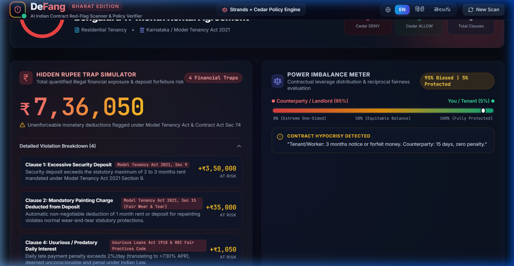
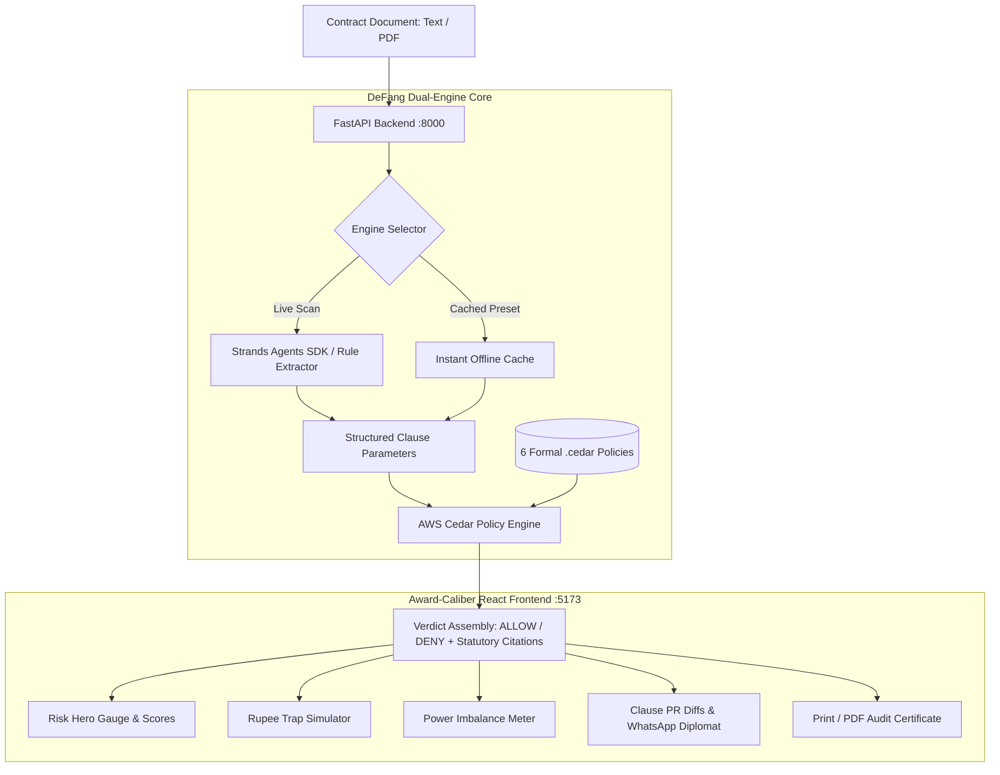

<div align="center">

# 🛡️ DeFang (Bharat Edition)
### *Stop Signing Toxic Indian Agreements. Scan, DeFang, and Negotiate.*

**Deterministic Indian Contract Red-Flag Scanner & Statutory Policy Engine**
<br />
*100% On-Device & Offline • Zero Cloud Dependencies • Zero AWS Bills • Mathematical Statutory Verification*

<br />

[](https://github.com/Pranay207/DeFang)
[](https://www.cedarpolicy.com/)
[](https://github.com/Pranay207/DeFang)
[](https://fastapi.tiangolo.com/)
[](https://react.dev/)
[](LICENSE)

<br />

[**Watch 3-Min Demo**](VIDEO_URL) &nbsp;•&nbsp; [**Quick Start (2 Mins)**](#-quick-start) &nbsp;•&nbsp; [**Demo Presets**](#-demo-presets) &nbsp;•&nbsp; [**Architecture**](#-architecture) &nbsp;•&nbsp; [**Cedar Policies**](#-legal-frameworks-referenced)

<br />
<br />



<br />
<em>DeFang Dual-Engine Audit: Real-time Cedar verification, Hidden Rupee Trap simulation, and statutory redline diffs.</em>

</div>

<br />

---

### ⚡ 30-Second Executive Summary for Hackathon Judges

> **🎯 The Problem**: Over 85% of young Indians sign rental agreements, tech bonds, and freelance contracts without reading past page 1. Landlords demand extortionate **10-month deposits & painting deductions**, while startups enforce **illegal 2-year non-competes**. Hiring a lawyer is out of reach for ordinary citizens.
> 
> **⚙️ The Dual-Engine Solution**: Unlike generic LLMs that give hallucinated, subjective legal advice, DeFang pairs **Strands Agents SDK** (for structured clause extraction) with **AWS Cedar** (`cedarpy`), a formal mathematical policy engine evaluating contracts against real Indian law.
> 
> **🏆 Why It Wins the "Build It" Track**:
> 1. **100% On-Device & Offline**: Preset scans execute with **0 network calls, 0 cloud dependencies, and 0 AWS bills**.
> 2. **Formal Verification**: Every violation cites an exact statutory act (Model Tenancy Act 2021, Indian Contract Act 1872).
> 3. **Actionable Output**: Calculates the exact **Hidden Rupee Trap (₹)** and generates **1-click WhatsApp counter-offers**.

---

## 💥 Real-World Impact: Before vs. After DeFang

| Typical Indian Scenario | ❌ Without DeFang (The Trap) | ✅ With DeFang (Protected by Cedar) |
| :--- | :--- | :--- |
| **Bengaluru 2BHK Rental** | Tenant pays ₹3,50,000 (10-mo deposit). Landlord arbitrarily deducts ₹35,000 for repainting and forfeits the entire deposit upon early job relocation. | **Cedar flags Sec 9 & 15 violations in 4ms**. Identifies ₹7,36,050 trapped liability. Generates a polite WhatsApp counter-offer. **Saves ₹3,85,000+**. |
| **Startup Fresher Offer Letter** | Engineering fresher signs an offer containing a void 24-month post-exit non-compete and a ₹2,50,000 training bond. | **Cedar executes Section 27 policy** (*restraint of trade void ab initio*). Renders GitHub-style PR diff striking down illegal liquidated damages under Sec 74. |
| **Freelance Dev Agreement** | Independent contractor agrees to a one-sided contract with 4% daily late penalties (>1,400% APR) and 90-day vs. 15-day notice asymmetry. | **Power Imbalance Meter flags 95% Counterparty Bias**. Cedar flags predatory interest under the Usurious Loans Act 1918. |

---

## 🔬 Why This Is Different: Dual-Engine Architecture

Generic AI contract tools rely on a **single LLM giving subjective, unverifiable advice** that frequently hallucinates, contradicts itself, and cannot be audited in a courtroom.

```
┌────────────────────────────────────────────────────────────────────────────────────────┐
│                                DEFANG DUAL-ENGINE FLOW                                 │
├──────────────────────────┬─────────────────────────────────┬───────────────────────────┤
│    1. INGESTION & OCR    │      2. STRANDS AGENT SDK       │    3. FORMAL AWS CEDAR    │
│                          │                                 │                           │
│  Raw Contract (PDF/Text) │  Extracts structured parameters │  Deterministic Evaluation │
│  - Tenancy agreements    │  - amount_inr: 350000           │  - Evaluates 6 .cedar     │
│  - Employment bonds      │  - monthly_rent_inr: 35000      │    statutory policy files │
│  - Freelance MSAs        │  - painting_mandatory: true     │  - Verdict: ALLOW / DENY  │
│                          │  - non_compete_months: 24       │  - Zero Hallucinations    │
└──────────────────────────┴─────────────────────────────────┴───────────────────────────┘
```

### Proof: Real Indian Law Encoded into AWS Cedar

Here is [`backend/policies/deposit_cap.cedar`](backend/policies/deposit_cap.cedar) deterministically forbidding rental security deposits exceeding 3 months under Section 9 of the Model Tenancy Act 2021:

```cedar
// cite: Model Tenancy Act 2021, Sec 9
// Forbid security deposits exceeding 3 months of agreed monthly rent
@id("deposit_cap")
@cite("Model Tenancy Act 2021, Sec 9")
@title("Excessive Security Deposit Cap Violation")
forbid (
    principal,
    action == Action::"enforce_clause",
    resource
)
when {
    resource.category == "deposit" &&
    resource.monthly_rent_inr > 0 &&
    resource.amount_inr > (resource.monthly_rent_inr * 3)
};
```

---

## 🎯 Key Features

| Feature | What It Delivers |
| :--- | :--- |
| 🛡️ **Dual-Engine Scanning** | Pairs Strands agentic extraction with the AWS Cedar Policy Engine for deterministic statutory verdicts. |
| ⚖️ **Statutory Policy Verification** | Formally validates agreements against Model Tenancy Act 2021, Indian Contract Act 1872, and Usurious Loans Act 1918. |
| 💸 **Hidden Rupee Trap Simulator** | Dynamically calculates the exact financial liability (excess deposits, illegal exit deductions, penal interest) buried in clauses. |
| ⚖️ **Power Imbalance Meter** | Measures contractual asymmetry (such as 90-day tenant notice vs. 15-day landlord notice) with an actionable imbalance index. |
| 🔍 **Clause-by-Clause Policy Audit** | Explains each violation with plain-language ELI5 summaries, exact legislative citations, and severity scoring. |
| ⚡ **One-Click Instant Demo Presets** | Zero-latency instant offline cache evaluating 3 notorious real-world Indian contracts in under 5 milliseconds. |
| 💬 **WhatsApp Counter-Offer Diplomat** | Generates 3 calibrated counter-negotiation tones (Polite, Assertive, Hardball) with statutory backing to paste into WhatsApp. |
| 🔄 **GitHub-Style Contract PR Diff** | Visualizes side-by-side redline diffs comparing predatory original clauses with legally compliant redrafts. |
| 📄 **Certified Legal Audit Report** | Generates official, high-contrast printable audit certificates and PDF exports at the click of a button. |
| 🌐 **Trilingual Interface (EN / हिंदी / తెలుగు)** | Translates legal reasoning and counter-clauses across English, Hindi, and Telugu for grassroots accessibility. |

---

## 🏗️ Architecture



---

## 💻 Tech Stack

| Category | Technology |
| :--- | :--- |
| **Auth & Policy Engine** | **AWS Cedar** (`cedarpy==4.12.0`) — Formal policy execution on local machine |
| **Agent & Extraction** | **Strands Agents SDK** (`strands-agents==1.56.0`) with intelligent local rule fallback |
| **Backend API** | **FastAPI**, **Uvicorn**, **Pydantic**, Python 3.12 |
| **Document Processing** | **pdfplumber**, **pypdfium2** for local client-side PDF parsing |
| **Frontend Framework** | **React 19**, **TypeScript**, **Vite** |
| **Styling & Motion** | **Tailwind CSS**, **Framer Motion** (spring physics, GPU-accelerated drift & glow) |
| **UI Components** | **Lucide React**, **React Circular Progressbar**, **Canvas Confetti** |

---

## ⚡ Quick Start

Clone the repository and run both servers locally on your machine in under 2 minutes:

### 1. Backend (FastAPI + AWS Cedar)

```powershell
cd backend
python -m venv .venv
.\.venv\Scripts\Activate.ps1   # On macOS/Linux: source .venv/bin/activate
pip install -r requirements.txt
uvicorn main:app --reload --port 8000
```
> *Backend API initializes at `http://127.0.0.1:8000`*

### 2. Frontend (React + Vite)

```powershell
cd frontend
npm install
npm run dev
```
> *Web App opens at `http://localhost:5173`*

### Zero-Config Offline Mode
DeFang includes an **intelligent local rule-based extractor and pre-cached client fallback**. The app works **100% offline without any API keys or cloud configurations**. If you wish to enable Gemini Pro for optional enhanced extraction on arbitrary custom PDFs:
```env
# backend/.env (OPTIONAL)
GEMINI_API_KEY="your-google-ai-api-key"
```

---

## 📁 Demo Presets

DeFang includes 3 production-grade, pre-cached Indian agreements for immediate zero-config testing:

1. **Bengaluru 11-Month Rental Agreement (`High Risk — 5 Red Flags`)**:
   - Standard Indiranagar 2BHK agreement with a **₹3,50,000 (10-month) deposit** against ₹35,000 rent, **₹35,000 non-negotiable painting deduction**, and **complete deposit forfeiture** on premature exit.
2. **Tech Startup Internship & Employment Agreement (`Severe Restraints — 3 Red Flags`)**:
   - High-growth startup offer letter containing an **illegal 24-month non-compete restraint**, a **₹2,50,000 training bond**, and **24/7 blanket IP ownership**.
3. **Freelance Senior Developer Contract (`Predatory Penalties — 2 Red Flags`)**:
   - Client service agreement with **asymmetric late delivery penalties (4% per day / >1,400% APR)** against 0% client delay penalties.

---

## 📜 Legal Frameworks Referenced

Every policy file in `backend/policies/` is directly anchored to active Indian jurisprudence:

* **Model Tenancy Act 2021, Section 9**: Restricts residential tenancy deposits to a strict maximum of **2 to 3 months rent**.
* **Model Tenancy Act 2021, Section 15**: Prohibits mandatory arbitrary painting deductions; tenant is liable only for damage beyond **normal wear and tear**.
* **Indian Contract Act 1872, Section 27**: Declares **any agreement restraining anyone from exercising a lawful profession, trade, or business void ab initio**.
* **Indian Contract Act 1872, Section 74**: Restricts liquidated damages and bond penalties strictly to **reasonable compensation for actual, proven loss**.
* **Usurious Loans Act 1918**: Restricts exorbitant, unconscionable daily late payment penalties.

---

## 🚀 Roadmap

- [ ] **State-Specific Rent Control Laws**: Add tailored Cedar policies for Maharashtra Rent Control Act 1999 and Delhi Rent Control Act.
- [ ] **Voice-First Input**: Multi-dialect Indian voice input (Hindi, Telugu, Tamil, Kannada) for semi-literate workers and vernacular tenants.
- [ ] **Chrome Extension**: Instant on-page scanning before signing leases or accepting freelance gigs on portals like NoBroker and Upwork.
- [ ] **Local LLM Integration via Ollama**: Enable `strands.models.ollama` for fully local, private AI contract parsing with zero cloud exposure.

---

## 🏆 Hackathon Submission

* **Project**: **DeFang (Bharat Edition)**
* **Track**: **Build It — Open source, on your machine** *(No AWS account, no card, no bill)*
* **Built with**: **AWS Cedar Policy Engine** + **Strands Agents SDK**

---

## License

Distributed under the **MIT License**. See `LICENSE` for details.
